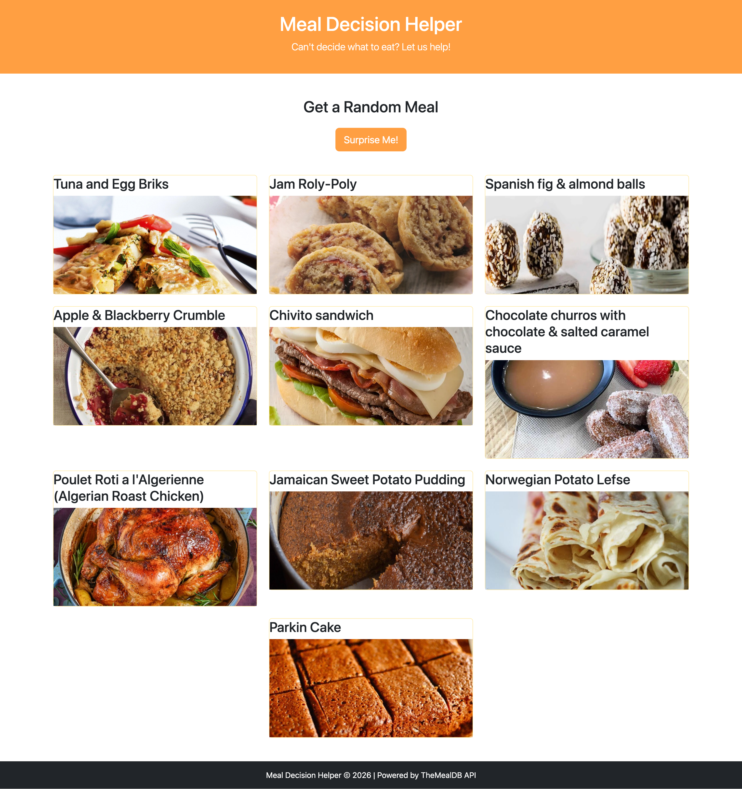

# Meal Decision Helper

## Project Description
A web application that helps users decide what to eat using TheMealDB API. Users can get random meal suggestions with images and ingredients.

## Live Demo
https://meal-decision-helper.netlify.app/

## Screenshot

## Technologies
- HTML5
- CSS/Bootstrap 5
- Vanilla JavaScript
- TheMealDB API

## Features
- Display random meal with image and name
- Show ingredients with measurements
- Multiple meals displayed in a grid layout (3 per row)
- New meals appear at the top
- Responsive design with Bootstrap

## API
- TheMealDB (https://www.themealdb.com/)
- Free API, no key required
- Provides meal data including images, ingredients, and instructions

## Project Info
- Solo project
- JavaScript Portfolio Project for Nucamp Bootcamp